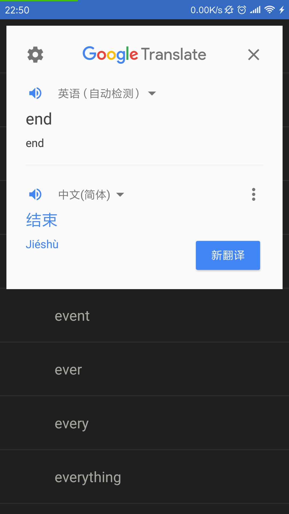
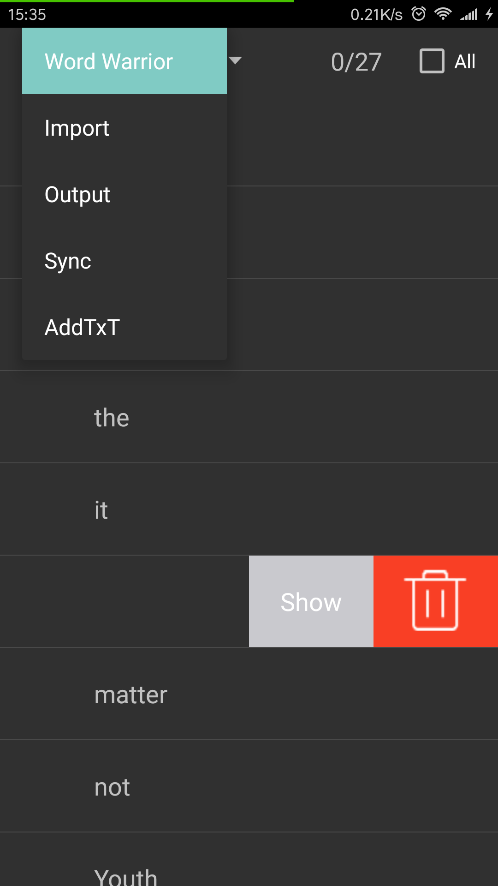
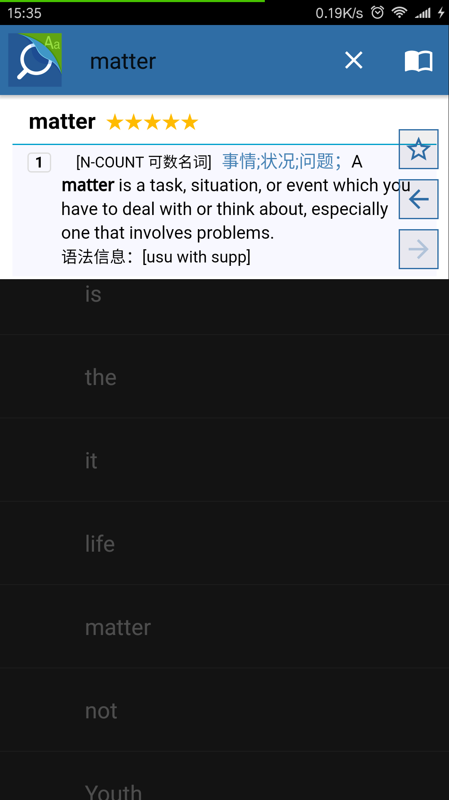
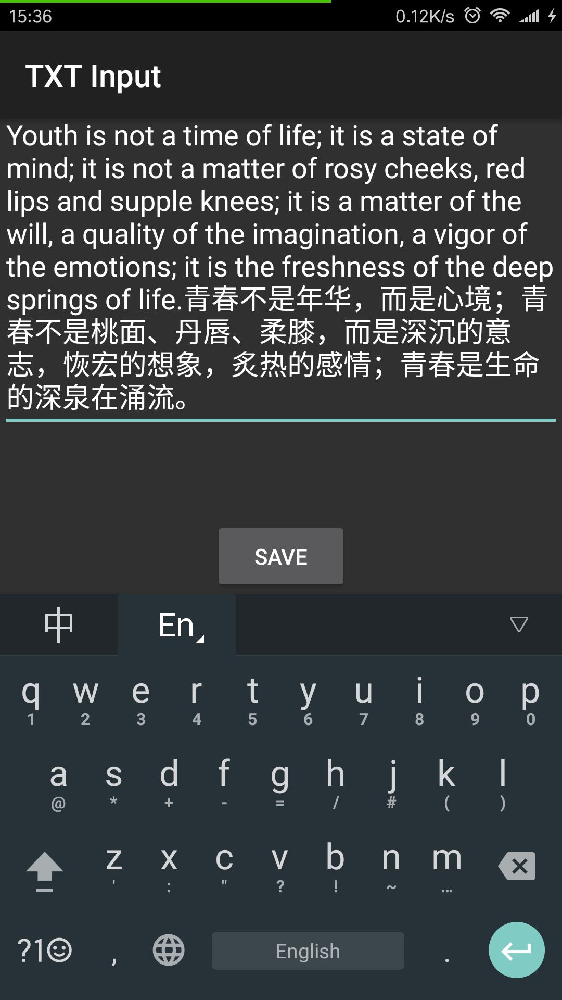

# WordWarrior
一个个性化的安卓英语单词本应用，配合谷歌翻译或mdict效果更好哦！

## TODO List

- [ ] 修复单词db的保存和恢复
- [ ] 设计一个根据记忆提供复习的方法
- [ ] 建立一个后台与之同步，利用平时分析的数据

> 大家想要什么新的功能，欢迎在 [#1](https://github.com/talengu/WordWarrior/issues/1) 提，搜集一波需求。

## 功能
- 从文章中分析单词词频
- 修改是否记住标记
- 查询单词意思
- 可导出导入单词

## 使用
- Android Studio最新版
- Android phone  android:minSdkVersion="11"  android:targetSdkVersion="17"
- 除baoyz.swipemenulistview，不需要其他库
- 熟悉SQLite的增删改查、listview的使用即可。

## 数据库说明（wordwarrior.lib）
- 表MyWord没有放任何数据
- 表TmpWord放了柯林斯5星的680个单词，没有单词意思，单词意思靠mdict查
- 在程序中两个表的相关操作都在sqlhelper和WordDAO完成（com\talengu\wordwarrior\sql下）

## 其他说明
- 此项目包含一个第三方库baoyz.swipemenulistview(我将源代码放在了我的项目中)，在此表示感谢。
- 欢迎大家fork和给我建议！

## 版本

### V1.1  
apk文件[下载地址](https://github.com/talengu/WordWarrior/releases)

**功能**
- 从文章中分析单词词频
- 修改是否记住标记
- 查询单词意思【单点 某个单词 】【长点 前后 20个单词】
- 可导出导入单词

好久没有更新了，添加google translate的支持。

### V1.0  
**功能**
- 从文章中分析单词词频
- 修改是否记住标记
- 查询单词意思（点击调用黏贴板，mdict响应）
- 可导出导入单词

debug-apk文件[下载地址](https://github.com/talengu/WordWarrior/releases)  
最稳定版本 [Google Play下载](https://play.google.com/store/apps/details?id=com.talengu.wordwarrior)

mdict Android安装包[下载地址](http://www.mdict.cn/wp/?lang=zh)  

